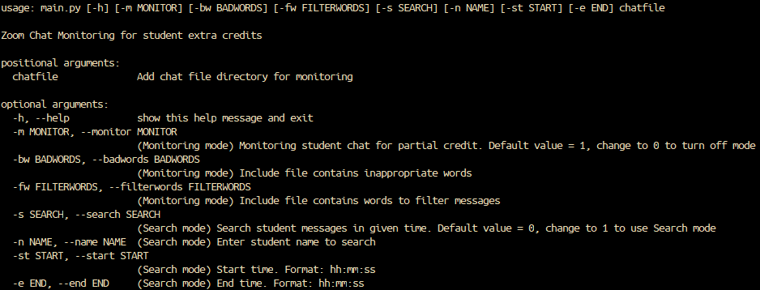

# Zoom Chat Monitoring Application

## Project for VandyHacks VII

This app is intended for teachers who use Zoom for their online teaching purposes.
There are a few functions it can perform: checking for chat participation, flagging
inappropriate language, or searching for chats from a specific student. During this
time of increased remote classwork, this can be a useful tool for teachers to
obtain quick stats on their students' involvement in the Zoom classroom, through
smooth interaction on a user-friendly GUI.

## What problem are we solving

With COVID-19, Zoom usage dramatically increased, especially for universities.
This presented an obstacle for classes that rely on participation. Some professors
have chosen to document participation by manually scanning the Zoom chat for names.
This is extremely time consuming and leaves lots of room for error.

## What it does

Our program will scan Zoom files using given parameters. One function will scan
all messages, and award a point to each student that submits “meaningful”
participation, meaning that it was relevant to the lecture and not simply a
greeting or interjection such as “oh.” The program will output a .csv file of
grades for each student’s participation that day. Another feature will scan the
chat log for any inappropriate language, flagging each individual and their
associated message. The program will output a .csv file of flagged messages and
students for further review. The final feature will search the chat log within
a specified time for a specific student’s contributions, and return the search
results to the screen.

## Usage

    - After concluding a Zoom meeting, download the chat and note the file
      location of where it saves.
    - Open the dist folder.
    - Run the executable to start up the interface.
    	**WARNING: only tested on Windows OS**
    - Choose the option desired. (Please check only one box!)
    - Under "Upload chat log," navigate to the file that contains the Zoom chat.
    - If you would like to provide a custom list of inappropriate words or filter
      words (those which do not denote meaningful input, like "lol" or "oh"),
      attach them under their respective tabs.
    - Click the Start button.
    - Once finished, the output will be written to a .csv file.

## Challenges we ran into

The Zoom API does not allow us to get in-meeting chat asynchronously so we have
to switch to downloading chat in .txt file format. Since each member uses different
operation system, we had encountered some problem analyzing directory and run
the app using command line on the terminal and cmd for Windows. Moreover, we
wanted to experiment with building GUI app using Python so there were a lot
research had been done and bugs encountered.

## What we have learned

We have learned how to use Github for group project, build Python GUI app.

## Future plan

This is applicable to the future because COVID-19 has likely changed the world
forever because it has shown us that online and remote work is possible, for
both students, faculty, and professionals. Zoom will likely be used now more
than ever, and it will be necessary to track chat messages for things like
classes or meetings. Furthermore, Zoom API developers have expressed that chat
APIs are coming soon, which would allow chat messages to be tracked in real time.
This project could also be generalized for other Chat applications such as
Discord, Slack, or WhatsApp.

## Team Members

    - Alexis Edwards
    - My Dinh
    - Gladys Toledo-Rodriguez
    - Jackie McAninch
